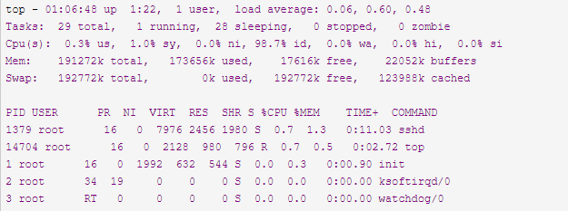

# Linux 系统监控工具（一）

## 目的

1. **找出系统瓶颈**
2. 磁盘（存储）瓶颈
3. CPU和内存瓶颈
4. 网络瓶颈

### TOP命令

**top 运行中可以通过 top 的内部命令对进程的显示方式进行控制**

| 参数 | 含义                                                    |
| ---- | ------------------------------------------------------- |
| s    | 改变画面更新频率                                        |
| l    | 关闭或开启第一部分第一行 top 信息的表示                 |
| t    | 关闭或开启第一部分第二行 Tasks 和第三行 Cpus 信息的表示 |
| m    | 关闭或开启第一部分第四行 Mem 和 第五行 Swap 信息的表示  |
| N    | 以 PID 的大小的顺序排列表示进程列表                     |
| P    | 以 CPU 占用率大小的顺序排列进程列表                     |
| M    | 以内存占用率大小的顺序排列进程列表                      |
| h    | 显示帮助                                                |
| n    | 设置在进程列表所显示进程的数量                          |
| q    | 退出 top                                                |



统计信息前五行是系统的统计信息，第一行是任务队列信息，同uptime命令的执行结果

**备注：top命令终端下，键盘按l可以切换top显示**

第一行Top：

1. 01:06:48    表示当前系统时间
2. up 1:22    表示系统已经运行时间
3. 1 user    表示当前登录用户的数量
4. load average 0.06,0.60,0.48    表示相应最近5、10和15分钟内的平均负载

第二行Tasks：

1. 29 total    进程总数
2. 1 running    正在运行的进程数
3. 28 sleeping    睡眠的进程数
4. 0 stopped    停止的进程数
5. 0 zombie    僵尸进程数

第三行Cpu(s)：

1. 0.3% us    用户态 CPU 时间
2. 1.0% sy   内核态 CPU 使用率
3. 0.0% ni    用户进程空间内改变过优先级的进程占用CPU百分比
4. 98.7% id    代表空闲时间
5. 0.0% wa    代表等待 I/O的CPU时间
6. 0.0% hi    硬件CPU中断占用百分比
7. 0.0% si    软中断占用百分比
8. 0.0% st    虚拟机占用百分比

第四行：

1. 191272k total    物理内存总量
2. 173656k used    使用的物理内存总量
3. 17616k free    空闲内存总量
4. 22052k buffers   缓存，主要用于目录方面,inode值等（ls大目录可看到这个值增加）
5. cached 缓存，用于已打开的文件

第五行：

1. 192772k total    交换区总量
2. 0k used    使用的交换区总量
3. 192772k free    空闲交换区总量
4. 123988k cached    缓冲的交换区总量,内存中的内容被换出到交换区，而后又被换入到内存，但使用过的交换区尚未被覆盖，该数值即为这些内容已存在于内存中的交换区的大小,相应的内存再次被换出时可不必再对交换区写入。

主体含义：

| 指标    | 含义                                                         |
| ------- | ------------------------------------------------------------ |
| PID     | 进程ID，进程的唯一标识符                                     |
| USER    | 进程所有者的实际用户名                                       |
| PR      | 进程的调度优先级。这个字段的一些值是'rt'。这意味这这些进程运行在实时态 |
| NI      | 进程的nice值（优先级）。越小的值意味着越高的优先级。负值表示高优先级，正值表示低优先级 |
| VIRT    | 进程使用的虚拟内存。进程使用的虚拟内存总量，单位kb。VIRT=SWAP+RES |
| RES     | 驻留内存大小。驻留内存是任务使用的非交换物理内存大小。进程使用的、未被换出的物理内存大小，单位kb。RES=CODE+DATA |
| SHR     | SHR是进程使用的共享内存。共享内存大小，单位kb                |
| S       | D - 不可中断的睡眠态。 R – 运行态 S – 睡眠态 T – 被跟踪或已停止 Z – 僵尸态 |
| %CPU    | 自从上一次更新时到现在任务所使用的CPU时间百分比              |
| %MEM    | 进程使用的可用物理内存百分比                                 |
| TIME+   | 任务启动后到现在所使用的全部CPU时间，精确到百分之一秒        |
| COMMAND | 运行进程所使用的命令。进程名称（命令名/命令行）              |

#### 怎么判断系统是否负载过高？

理想每个核不超过1，所以先查看自己处理器是几何

```
cat /proc/cpuinfo|grep "cores"|uniq
```

负载过高：每分钟平均负载>=cpu核数*3

#### 如何通过CPU指标排查问题？

1. us和ni高，说明用户态进程占用了较多的 CPU，所以应该着重排查进程的性能问题。

2. sy高，说明内核态占用了较多的 CPU，所以应该着重排查内核线程或者系统调用的性能问题。

3. wa 高，说明等待 I/O 的时间比较长，所以应该着重排查系统存储是不是出现了 I/O 问题。

4. hi和si，说明软中断或硬中断的处理程序占用了较多的 CPU，所以应该着重排查内核中的中断服务程序。

#### CPU使用率计算公式？

CPU使用率=1-空闲时间/总CPU时间

#### 内存计算公式？

total=used+free
used=buffers+cached

#### 什么是Cache Memory(缓存内存)？

当你读写文件的时候，Linux内核为了提高读写性能与速度，会将文件在内存中进行缓存，这部分内存就是Cache Memory(缓存内存)。即使你的程序运行结束后，Cache Memory也不会自动释放。这就会导致你在Linux系统中程序频繁读写文件后，你会发现可用物理内存会很少，没必要手动释放。

#### Cache Memory导致异常？

1. 在Linux中频繁存取文件，物理内存很快用光，而cached一直在增长。Linux会对每次请求过的数据缓存在cache里，好处就是CPU的处理速度远远高于内存，所以在CPU和内存通讯的时候可以快速从cache中命中结果返回。
2. Swap被占用。内存可能不够了，才会占Swap，所以Swap可以作为服务器监控的一项指标，引起注意。

#### 如何释放Cache Memory？

drop_caches的值可以是0-3之间的数字，代表不同的含义：

1. 0不释放（系统默认值）
2. 1释放页缓存
3. 2释放dentries和inodes
4. 3释放所有缓存

```
echo 3 > /proc/sys/vm/drop_caches
```

#### Linux OOM-killer 内存不足时kill高内存进程的策略？

Linux 内核有个机制叫OOM killer(Out Of Memory killer)，该机制会监控那些占用内存过大，尤其是瞬间占用内存很快的进程，然后防止内存耗尽而自动把该进程杀掉。内核检测到系统内存不足、挑选并杀掉某个进程的过程可以参考内核源代码linux/mm/oom_kill.c，当系统内存不足的时候，out_of_memory()被触发，然后调用select_bad_process()选择一个”bad”进程杀掉。如何判断和选择一个”bad进程呢？linux选择”bad”进程是通过调用oom_badness()，挑选的算法和想法都很简单很朴实：最bad的那个进程就是那个最占用内存的进程。

查看oom-killer服务日志

```
#
grep "Out of memory" /var/log/messages
# 查看系统日志方法
egrep -i -r 'killed process' /var/log
#
dmesg
```

#### 为什么要禁用swap？

swap，这个当内存不足时，linux会自动使用swap，将部分内存数据存放到磁盘中，这个这样会使性能下降，为了性能考虑推荐关掉。

```
# /etc/sysctl.conf 
vm.swappiness = 0
```

#### 查看内存占用top10？

```
ps aux|head -1;ps aux|grep -v PID|sort -rn -k +4|head
```

#### 查看cpu占用top10？

```
ps aux|head -1;ps aux|grep -v PID|sort -rn -k +3|head
```

#### 有关内存消耗最大进程

```
ps aux --sort -rss | head
```

#### 查看进程内部线程占用分析？

```
top -H -P 实际PID
```
#### Linux进程及线程限制？

```
# 查看用户最大进程数（max user processes）
ulimit -a 
# 查看系统可生成最大线程数
cat /proc/sys/kernel/threads-max
# 查看单个项目线程数
ps -eLf | grep 项目名 | wc -l 
# 查看进程最大线程数
cat /proc/sys/vm/max_map_count 
# 查看pid上限
cat /proc/sys/kernel/pid_max 
# 查看当前已用的进程或线程数
pstree -p | wc -l 
# 查看linux的线程模型
getconf GNU_LIBPTHREAD_VERSION 
```

#### 修改root用户最大进程数？

```
echo "* soft nproc 65535"  >> /etc/security/limits.conf
echo "* hard nproc 65535"  >> /etc/security/limits.conf
```

#### 僵尸进程的产生、危害、规避方法？

含义：子进程终止后，直到父进程调用wait()前的时间里，子进程被称为zombie；

具体原因：

1. 子进程结束后向父进程发出SIGCHLD信号，父进程默认忽略了它。
2. 父进程没有调用wait()或waitpid()函数来等待子进程的结束。
3. 网络原因有时会引起僵尸进程；

危害：僵尸进程会占用系统资源，如果很多，则会严重影响服务器的性能；

规避方法：

1. 让僵尸进程成为孤儿进程，由init进程回收；(手动杀死父进程)
2. 调用fork()两次；
3. 捕捉SIGCHLD信号，并在信号处理函数中调用wait函数；

#### 查看buffer/cache占用排名？
```
chmod 755 hcache
./hcache  -top 10 
```
## 参考：

[CPU核数和load average的关系](https://blog.csdn.net/duzilonglove/article/details/80111753)


